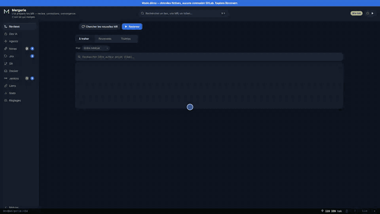

<h1>
  <picture>
    <source media="(prefers-color-scheme: dark)" srcset="public/images/wordmark-dark.svg" />
    
  </picture>
</h1>

[](https://github.com/debugall/mergerie/actions/workflows/ci.yml)
[](./LICENSE)

**From prompt to merge — a local AI dev cockpit for GitLab and GitHub.**

*Mergerie* (pronounced *mer-zhuh-REE*) is a local, single-user web app that turns an AI agent CLI into a
review-and-ship workstation for your GitLab and GitHub projects.

Everything runs **on your machine** — a Node + SQLite server and a web UI, nothing sent anywhere except the
services **you** configure. It drives your **existing Claude or Copilot subscription** through their own CLI
(`claude` / `copilot`), so there are no extra API keys or tokens to buy. The AI **prepares** the work — review,
corrections, autonomous convergence — and **you** merge.



## Quick start

Requires **Node 22.9+**.

```bash
npm install
npm start          # http://localhost:4319
```

**`npm run demo` — see it live in 30 seconds, no config, no tokens.** It seeds a realistic fake database
(reviews, scores, resolution tracking, token cost, AI sessions, and a browsable fictional repository behind
"View diff") into an isolated `data-demo/`, then launches the tool on it in dry-run — no forge connection,
no token required.

```bash
npm run demo       # http://localhost:4319
```

> Throughout the docs, **"MR"** means either a GitLab *merge request* or a GitHub *pull request* — the
> screens and actions are identical.

## What it does

Ten tabs in a left sidebar, each one line — plus the objective verification, which lives inside Reviews and Settings:

- **Reviews** — AI-scored, versioned reviews of GitLab merge requests **and GitHub pull requests**; incremental re-reviews; an autonomous **convergence loop** (review → fix → re-review until the score threshold) Convergence works on the *review*; the **objective verification** comes after, on the merge request itself — see the guide. A report stays with you unless you decide otherwise: one button **publishes it as a comment on the merge request**, and a setting does it automatically at the end of every review — unchecked by default, because writing on other people's work is a decision.
- **AI Dev** — automated coding sessions (the AI codes, commits, pushes, opens the MR), off-repo coding (with the AI's report back and follow-ups that continue the session), read-only code exploration, and **free questions** asked with no repository at all (kept, labelled and resumable) — *from prompt to converged MR* in one click. On a multi-repo session each project runs, and takes a follow-up fix, on its own. A follow-up can be **written while a session is still running** and waits on the card until you send it — or goes out by itself at the end of the session if you tick the box. Finished sessions can be tidied away without being deleted.
- **Objective verification** — a plain list of commands (`npm ci`, `npm test`) gives a merge request a verdict that isn't an opinion: `✓ verified`, `✗ 2 tests broken`, `⚠ base already red`. Broken test names are read straight from TAP or JUnit output when there is any. Merge requests from different repositories that only hold together as a set are **verified together**, and one click opens a fixing session covering all of them. A verifier can also **start by itself on every new merge request** of the repositories it covers, and the verdict then waits on the card: `See the verifiers' results` opens what ran, on which commits, and what the commands returned. See the guide.
- **Jenkins** — see where your CI jobs stand and run them, without leaving the tool: every job your account sees, grouped by folder, with a search (a company installation has hundreds) and a filter for what is not fine. Running always asks first and names the job; a parameterised job opens its page instead, so you see what you are about to send. Nothing is polled — the screen asks when you open the tab.
- **Notes** — the sticky notes of everyday work, kept inside the tool: note pages in Markdown, a prioritised todo list with due dates that double as **desktop reminders**, and a **morning brief** that opens the day — reminders, sessions waiting for an answer, failed verifications, fresh and dormant MRs, all computed locally with **no AI call**. `!214` and `PROJ-720` written in a note become links, and a merge request or a ticket can be added to the todos in one click.
- **Jira** — your assigned tickets fetched automatically, full detail with attachments, status changes and comments; **watched tickets** (assigned to you or not) with a desktop notification on every status change, and a menu badge counting your in-progress tickets.
- **Git** — multi-repo branch/tag/command operations across both forges, branch explorer, ref finder and a **two-repository compare** (no common history required), **restorable** deletions, always with a preview.
- **Docker** — compose project health and `.env` drift, batch actions, live multi-container logs, error badges in the menu.
- **Links** — the work links your bookmarks cannot structure: a **services × environments grid** (one URL per cell, written out — no guessing an address from another), free links found by tag, and a **global palette** (`Ctrl`/`Cmd`+`K`) that searches links, MRs, tickets, notes and todos at once, ranked by frecency. A service linked to a repository puts buttons straight on its merge requests, including **templated** ones (`{env}`, `{branch}`, `{mr_iid}`) resolved on click. Chrome bookmarks import with a preview.
- **Stats** — MR funnel, score trends, per-project resolution rate, token cost.
- **Settings** — GitLab / GitHub / Jira connections, repositories (each one can opt out of MR fetching while staying usable for git and coding sessions), review rules, automatic review of merge requests on arrival (capped, off by default), automatic publishing of review reports on the MR, prompt templates, theme and language.

Everywhere: `Ctrl`/`Cmd` + `K` opens a command palette (jump to a tab, a merge request, a session by
name), `j` / `k` walk the current list, `?` lists every shortcut. The tool reopens on the tab and
review stage you left, and the report panel opens on what changed since your last visit.

## Learn more

- 🗺️ **[Roadmap](./ROADMAP.md)** — what's next (Bitbucket support, orchestrated releases, deployment piloting).
- 📖 **[Full guide](./docs/guide.en.md)** — every tab in detail, objective verification, `.env`, enterprise TLS, data & backup, security model. Also in **[🇫🇷 French](./docs/guide.fr.md)**.
- 🧭 **Architecture** — modules, data model, pipelines: **[PLAN.md (🇫🇷 French)](./PLAN.md)**.
- 🇫🇷 **Version française :** **[README.fr.md](./README.fr.md)**.
- 📜 **[Changelog](./CHANGELOG.md)** — what changed, release by release.
- 🔒 **[Security](./SECURITY.md)** — trust model and how to report a vulnerability.
- 🤝 **[Contributing](./CONTRIBUTING.md)** — how to run it in dev and open a merge request.
- 🦊 **Development happens on [GitLab](https://gitlab.com/amady/mergerie)** — merge requests are opened there
  and **reviewed by Mergerie itself**. This GitHub repository is a synchronized mirror; issues are welcome here.

## License

**GNU AGPL-3.0-only** — see [LICENSE](./LICENSE). You may use, modify and redistribute the code, but any
modified version **made available over a network** (SaaS included) must publish its source under the same
license.
