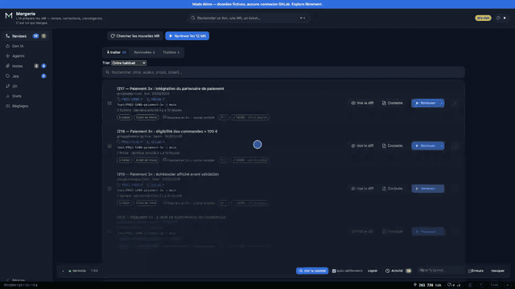

<h1>
  <picture>
    <source media="(prefers-color-scheme: dark)" srcset="public/images/wordmark-dark.svg" />
    
  </picture>
</h1>

[](https://github.com/debugall/mergerie/actions/workflows/ci.yml)
[](./LICENSE)

**From prompt to merge — a local AI dev cockpit for GitLab and GitHub.**

*Mergerie* (pronounced *mer-zhuh-REE*) is a local, single-user web app that turns an AI agent CLI into a
review-and-ship workstation for your GitLab and GitHub projects. One instance each — and a team shares its
accumulated work through a git repository it owns, with no server in between.

Everything runs **on your machine** — a Node + SQLite server and a web UI, nothing sent anywhere except the
services **you** configure. It drives your **existing Claude or Copilot subscription** through their own CLI
(`claude` / `copilot`) — Codex CLI and Gemini CLI are wired from their documentation, and any
other CLI runs as is, with the guarantee level said in plain words — so there are no extra API
keys or tokens to buy. The AI **prepares** the work — review,
corrections, autonomous convergence — and **you** merge.



## Quick start

Requires **Node 22.9+** and `git`.

```bash
npx mergerie demo    # see it live in 30 seconds — nothing to clone, no config, no token
npx mergerie         # the real thing: http://localhost:4319, your data in ~/.mergerie/data
```

From a clone, the same two things are `npm install` then `npm run demo` or `npm start`, with the
data next to the code (`data-demo/`, `data/`).

On its **first launch**, `npx mergerie` looks for `claude` then `copilot` on the machine and writes a
short `.env` in `~/.mergerie/` pointing `AGENT_BIN` at the one it finds. **The agent is then set on
screen** — Settings → AI session: a list of **binaries** (binary, arguments, timeout, environment
variables, a *Test* button each), one being the default, as many others as you like (a Claude Code on
a local Ollama next to your Claude Max), and a session picks its own — with no restart. If no agent is found, a banner says so, with the install commands; reports are **simulated**
and say so until it is fixed.

The **Reviews** tab opens on a five-step assistant: the agent, the forge (GitLab **or** GitHub), your
repositories, what your team uses (Jira, Jenkins, Docker, environments — ticked menus unfold, the
others stay folded), and the first fetch of merge requests, which then refreshes every 5 minutes by
default. **[First real review in 5 minutes](./docs/guide.en.md#first-real-review-in-5-minutes)** in
the guide walks through it.

`PORT`, `HOST`, `MERGERIE_DATA_DIR` and the settings of [`.env.example`](./.env.example) are
honoured either way. A `.env` **in the folder the command is run from** overrides `~/.mergerie/.env`,
and what the shell exports wins over both, as everywhere with Node.

**`npm run demo` — see it live in 30 seconds, no config, no tokens.** It seeds a realistic fake database
(reviews, scores, resolution tracking, token cost, AI sessions, and a browsable fictional repository behind
"View diff") into an isolated `data-demo/`, then launches the tool on it in dry-run — no forge connection,
no token required. On the **Agents** side it carries the three shipped agents, two **domain agents** with
their versioned knowledge — one version awaiting validation, one unverified path, one reported gap — and a
run triggered by a **schedule** that rewrote a note page. One coding session carries **three iterations, the
last one with its diff**, and the out-of-repo session likewise, so the per-follow-up diff is
visible on both sides without an agent.

```bash
npm run demo       # http://localhost:4319
```

> Throughout the docs, **"MR"** means either a GitLab *merge request* or a GitHub *pull request* — the
> screens and actions are identical.

## Built for N repositories

What no editor assistant does: **twenty repositories at once**. One Git action on every repository
of a group in one gesture; the logs of ten containers without opening ten terminals; a batch of
merge requests from several micro-services **verified together**, and a coding session that fixes
the three repositories in one go; an agent that **maps a subject** across repositories; **repository
groups** that carry once the rules, verifiers and templates twenty micro-services share. **Most
coding sessions start from a ticket**: the Jira tab lists yours, and “Have the AI code” opens the
session already filled in. And `Ctrl`/`Cmd` + `K` finds **a deployment address in two keystrokes**,
where browser bookmarks make you walk through folders.

## What it does

Eleven tabs in a left sidebar, each one line — plus the objective verification, which lives inside Reviews
and Settings. **Git, Docker, Jenkins and Links start folded away**: they are conveniences, and the bar
carries the everyday work first — one tick in Settings → General → Menus brings them back for good, and
**so does a contextual door**: “Resolve in Git → Merge” on a conflicting merge request, “See the logs”
from the morning brief, “this repository has a compose file: show Docker” on a repository's row — a menu
opened that way stays in the bar.

- **Reviews** — AI-scored, versioned reviews of GitLab merge requests **and GitHub pull requests**; incremental re-reviews; an autonomous **convergence loop** (review → fix → re-review until the score threshold) Convergence works on the *review*; the **objective verification** comes after, on the merge request itself — see the guide. A question can be asked **about** a report — why is this finding blocking, does it hold for the other caller — and the answer lands under it without touching the report or its score. A report stays with you unless you decide otherwise: one button **publishes it as a comment on the merge request**, and a setting does it automatically at the end of every review — unchecked by default, because writing on other people's work is a decision. When your team shares a data repository, a second button posts the **link** to the report instead of its six hundred lines — one copy, read by everyone in the same place. And the verdict the forge itself reads: an **Approve** button (GitLab approval, GitHub `APPROVE` review — never a burst of inline comments), **Resolve / Reopen** on any discussion thread, and the **forge CI** (GitLab pipeline, GitHub checks) as a badge on every card. The morning brief counts what is **ready to merge** — score above the threshold, verified green, no ticket in the way. Nothing is merged: the tool says how many are only waiting for a decision.
- **AI Dev** — automated coding sessions (the AI codes, commits, pushes, opens the MR), off-repo coding (with the AI's report back and follow-ups that continue the session), read-only code exploration, and **free questions** asked with no repository at all (kept, labelled and resumable) — *from prompt to converged MR* in one click. On a multi-repo session each project runs, and takes a follow-up fix, on its own. The latest iteration keeps **the diff of what it changed** — off-repo included, where a tracking repository kept outside your folder stands in for the missing branch — so re-reading your last follow-up no longer means re-reading everything. A follow-up can be **written while a session is still running** and waits on the card until you send it — or goes out by itself at the end of the session if you tick the box. A session — coding, exploration or off-repo — can also be **scheduled for a date and time** from the same modal (“Create and schedule”), and so can a waiting follow-up (“Or send it on…”): the card shows the date with a cross to cancel it, launching by hand cancels it too, and the date belongs to *your* workstation — it is the one that launches, and catches up if it was off at that time. Finished sessions can be tidied away without being deleted. **“Plan first”**: the first pass reads and returns a plan, you read it on the card, add a remark, and **“Approve and code”** resumes the same agent session to carry it out. While a session runs, the follow-up field offers **“Stop and resume with this instruction”** — the pass stops, the instruction goes back to the same session. The job journal keeps its short lines, and each truncated agent message or `Edit` carries a **“… see”** that opens the full text or the diff. Jobs that touch different repositories **run in parallel by themselves**, hand-launched ones first.
- **Agents** — **session profiles**: a role, a scope, tools, skills, an output, sometimes a schedule. Two shipped examples — the **incident investigator**, which finds which repository and which file holds the code named by a trace, and the **librarian**, which keeps the service map in a note page — with a “who calls whom” diagram and, for each repository, its database schema read from the migrations. And **domain agents**: give a subject, the cartographer writes the map of that subject across the repositories — every path verified one by one, the map's age counted without AI, updates reviewed and validated. An agent never pushes and never publishes on its own.
- **Objective verification** — a plain list of commands (`npm ci`, `npm test`) gives a merge request a verdict that isn't an opinion: `✓ verified`, `✗ 2 tests broken`, `⚠ base already red`. Broken test names are read straight from TAP or JUnit output when there is any. Merge requests from different repositories that only hold together as a set are **verified together**, and one click opens a fixing session covering all of them. A verifier can also **start by itself on every new merge request** of the repositories it covers, and the verdict then waits on the card: `See the verifiers' results` opens what ran, on which commits, and what the commands returned. The commands run **on the host**: whoever wants a container writes `docker compose run --rm app npm test` in the line itself, and the form **suggests exact lines** from what the clone declares — npm, pnpm or yarn scripts, composer, Makefile targets, pytest and tox, `go test ./...`, `cargo test`, Maven, Gradle, `dotnet test` — with their `docker compose run` variant when a compose file is there. A hand-launched run sees your `HOME` **and says so** at the moment you click, with a **throwaway HOME** box remembered per verifier. During a convergence loop the verifier runs after each pass and its verdict shows on the panel — information beside the score, never an exit condition. See the guide.
- **Jenkins** — see where your CI jobs stand and run them, without leaving the tool: every job your account sees, grouped by folder, with a search (a company installation has hundreds) and a filter for what is not fine. Running always asks first and names the job; a parameterised job opens its page instead, so you see what you are about to send. Nothing is polled — the screen asks when you open the tab.
- **Notes** — the sticky notes of everyday work, kept inside the tool: note pages in Markdown — with **sub-pages**, one level deep, so a general page can carry the detail of each of its points, and **Mermaid diagrams** rendered in place, the library shipped in the repository and loaded only when a page holds one, a **full-screen** view that drops the page list to read one without distraction while Rendered / Two columns / Markdown stay one click away — a prioritised todo list with due dates that double as **desktop reminders**, and a **morning brief** that opens the day — reminders, sessions waiting for an answer, failed verifications, fresh and dormant MRs, all computed locally with **no AI call**. `!214` and `PROJ-720` written in a note become links, and a merge request or a ticket can be added to the todos in one click.
- **Jira** — your assigned tickets fetched automatically, full detail with attachments, linked tickets (grouped by relation, opened without leaving the tab), status changes and comments; **watched tickets** (assigned to you or not) with a desktop notification on every status change, and a menu badge counting your in-progress tickets.
- **Git** — multi-repo branch/tag/command operations across both forges, a **branch merge with on-screen conflict resolution** (both versions side by side, keep one, keep both, or write your own; then commit and push, each behind its own confirmation), branch explorer, ref finder and a **two-repository compare** (no common history required), **restorable** deletions, always with a preview.
- **Docker** — compose project health and `.env` drift, batch actions, live multi-container logs, error badges in the menu.
- **Links** — the work links your bookmarks cannot structure: a **services × environments grid** (addresses written out — no guessing one from another), where a cell shows its three most opened and opens the rest in a panel anchored on it, so a row's height never depends on its content. You add by **pasting**: one URL per line, and the tool suggests the name, the service and the environment — never silently, and never a "likely" column. Free links are a compact list found by tag, and a **global palette** (`Ctrl`/`Cmd`+`K`) searches links, MRs, tickets, notes and todos at once, ranked by frecency. A service linked to a repository puts buttons straight on its merge requests, including **templated** ones (`{env}`, `{branch}`, `{mr_iid}`) resolved on click. Chrome bookmarks import with a preview.
- **Stats** — MR funnel, score trends, per-project resolution rate, token cost, **the five most expensive sessions** and **the findings that keep coming back** — the same finding raised on three merge requests of one repository turns into a review rule in one click. Every number is a door: it opens Reviews filtered on that repository, at the right stage.
- **Settings** — GitLab / GitHub / Jira connections, repositories (each one can opt out of MR fetching while staying usable for git and coding sessions), review rules, automatic review of merge requests on arrival and automatic re-review when a report goes stale (both capped, both off by default), automatic publishing of review reports on the MR, prompt templates, theme and language, review rules that can be limited to one repository, the default boxes of a new session, and the Jenkins jobs linked to your repositories. Every field carries a **“team” / “this machine”** badge: prompt templates, thresholds and policies describe the tool, while API tokens, the clone folder and the language belong to your machine alone — and are stored apart. Point it at a git repository and a **team shares the accumulated work** — review rules, verifiers, agents and their map of the code, and the notes pages, sessions and todos you tick — while everyone keeps their own instance, tokens and AI subscription. What you write without a reader in mind (a session, a question, a draft) stays yours until you say otherwise. **Repository groups**: twenty micro-services that share the same review rules, verifiers, prompt templates and standing instructions carry them once, on a group that travels with the team — and one chip per group fills a session, a Git action or a verifier's coverage with all its members.

Everywhere: `Ctrl`/`Cmd` + `K` opens a command palette (jump to a tab, a merge request, a session by
name — `!217` or `PROJ-1408` typed alone go straight there), `j` / `k` walk the current list,
`v` / `c` / `m` / `x` act on the focused card, `?` lists every shortcut. **What grows without limit is kept in check.** Job journals beyond the retention you set are purged; a merge request merged or closed for longer than a second delay keeps its last report and loses the previous versions, the stored diff and its working folder; clones nobody has fetched for a month get a `git gc`; a clone can be made **without blobs** (`--filter=blob:none`) for the next repositories; and Settings → General shows **what the data weighs, by category**, with a “Clean up now” button.

**Any window you type into
minimises** to the bottom of the menu with a `—`, so you can go and check a branch name or a ticket
without losing what you had written, and come back to it — fields, cursor and tab included. The
tool reopens on the tab and review stage you left, and the report panel opens on what changed since
your last visit.

**The tabs talk to each other.** A todo tied to a merge request ticks itself when that merge request
is merged; the last Jenkins build carrying a branch is written on its merge request card; a ticket
moved to review pushes its merge requests to the top; an exploration turns into a coding session
**in the same agent session**; the branches of merged merge requests gather into one lot; and a
verification that runs in place says the state of the Docker services before it starts.
A review report says **which notes cite it** and **which domain map it touches** — and hands that map
to the AI as review context; a red verdict leaves a todo behind and, if you ask, a comment on the
Jira ticket; a failed Jenkins console and a red verification open the **incident investigator** with
the trace already in the request; and the morning brief picks up **the merge left half-resolved
yesterday**, the Git operations that failed and the containers that went down — the last of these
watched by the server itself, like the end of a Jenkins build you started from here, so it reaches
you with the tab closed.

## Learn more

- 🗺️ **[Roadmap](./ROADMAP.md)** — what's next (Bitbucket support, orchestrated releases, deployment piloting).
- 📖 **[Full guide](./docs/guide.en.md)** — every tab in detail, objective verification, `.env`, enterprise TLS, data & backup, security model. Also in **[🇫🇷 French](./docs/guide.fr.md)**.
- 🧭 **Architecture** — modules, data model, pipelines: **[PLAN.md (🇫🇷 French)](./PLAN.md)**.
- 🇫🇷 **Version française :** **[README.fr.md](./README.fr.md)**.
- 📜 **[Changelog](./CHANGELOG.md)** — what changed, release by release.
- 🔒 **[Security](./SECURITY.md)** — trust model and how to report a vulnerability. In short: localhost by
  default, a token when exposed, and a second local-only token closing the API to any process on the
  machine that isn't your browser; code that arrives through the shared repository waits for your approval
  on this machine; one switch per machine for the agent itself — **secured** (reviews and explorations
  run it read-only, coding runs it under a CLI sandbox verified by a real test call, or a command
  allowlist) or **yolo** (no restriction of the agent, the default) — with, either way, a filtered
  environment, the forge token out of the clone, and every agent output block tied to the nonce of its
  own run.
- 🤝 **[Contributing](./CONTRIBUTING.md)** — how to report a bug or an idea, how to run it in dev, and why
  **pull requests are not accepted**: Mergerie is written by one maintainer, who stays its only rights holder.
- 🦊 **Development happens on [GitLab](https://gitlab.com/amady/mergerie)** — merge requests are opened there
  and **reviewed by Mergerie itself**. This GitHub repository is a synchronized mirror; **issues are welcome
  here**, pull requests are closed automatically.

## License

**GNU AGPL-3.0-only** — see [LICENSE](./LICENSE). You may use, modify and redistribute the code, but any
modified version **made available over a network** (SaaS included) must publish its source under the same
license.
